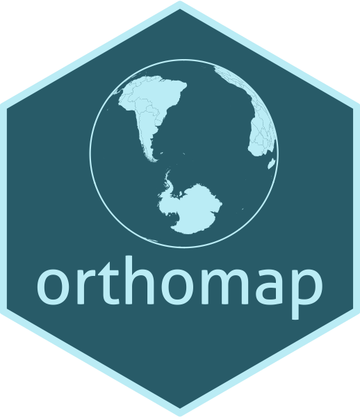
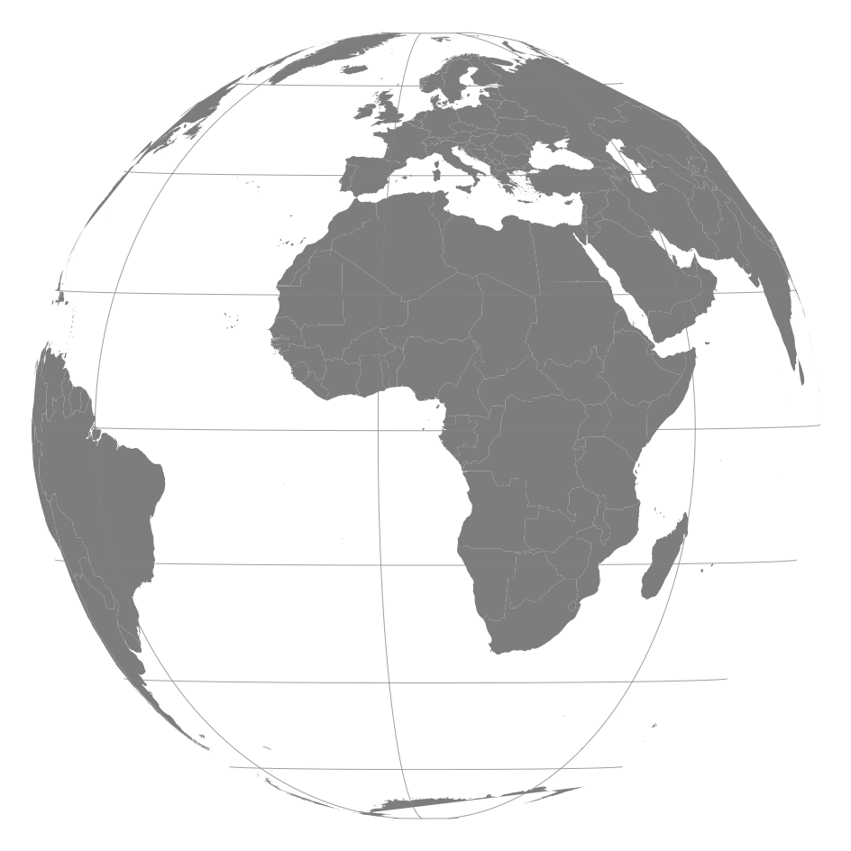
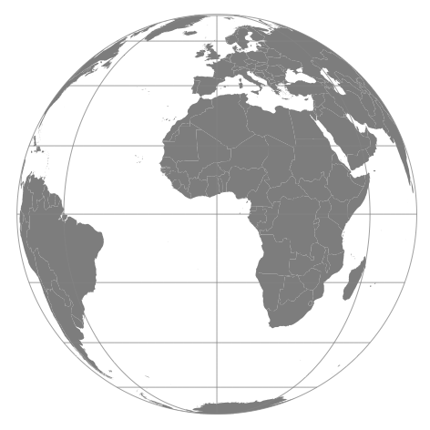
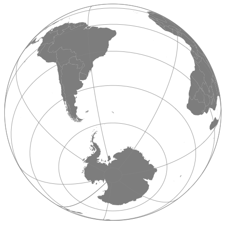
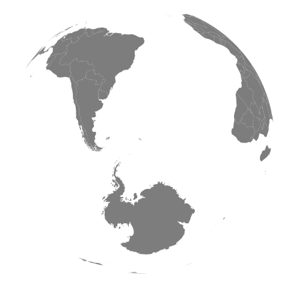
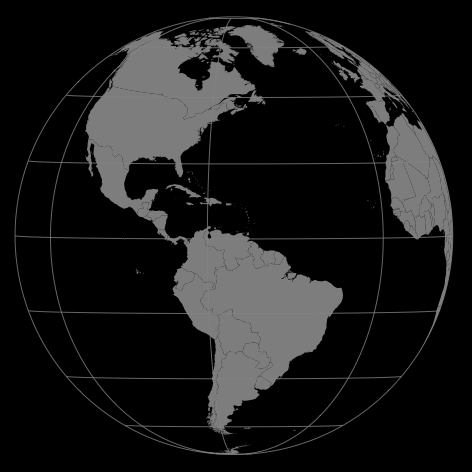
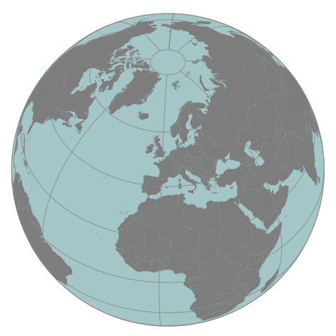

orthomap 
=========================================================

[](https://travis-ci.org/ahasverus/orthomap) [](http://www.gnu.org/licenses/gpl.html)

Overview
--------

The package **orthomap** contains one single function: `orthomap()`. It was designed to solve a common issue encountered when using the `map()` function of the [**maps**](http://cran.r-project.org/web/packages/maps/index.html) package in the orthographic projection: some polygons are not correctly projected and some geographical aberrations appear in the final map (see figure below and pay attention to Russia and Antarctica). Moreover, the `orthomap()` function returns projected World country polygons into the `SpatialPolygons` format.



Installation
--------

To install the package **orthomap** from GitHub, first install the package [**devtools**](http://cran.r-project.org/web/packages/devtools/index.html) from the CRAN.

```r
### Install the < devtools > package
install.packages("devtools", dependencies = TRUE)

### Load the < devtools > package
library(devtools)
```

Then install the **orthomap** package:

```r
### Install the < orthomap > package from GitHub
devtools::install_github("ahasverus/orthomap")

### Load the < orthomap > package
library(orthomap)
```

Getting started
--------

Some useful command lines to get started:

```r
### List the content (objects and functions) of the < orthomap > package
ls("package:orthomap")

### Open the < orthomap > package home page
help(package = "orthomap")

### Open the help file of a specific function
help(orthomap)
```

Usage
--------

```r
### World orthographic map with default settings
world <- orthomap(
  query        = NULL,
  centre       = c(0, 0),
  border.color = NA,
  border.type  = 1,
  border.size  = 0.25,
  fill         = "#909090",
  globe        = "transparent",
  grid         = TRUE,
  nx           = 10,
  ny           = 10,
  grid.color   = "#969696",
  grid.type    = 1,
  grid.size    = 0.25
)

### Short version
world <- orthomap()
```



```r
### Class of the object returned
class(world)
# [1] "SpatialPolygons"
# attr(,"package")
# [1] "sp"

### Number of polygons
length(world)
# [1] 816
```

```r
### Center World map based on country name
world <- orthomap(query = "South Georgia")
```



```r
### Center World map based on coordinates
world <- orthomap(centre = c(20, 60))
```



```r
### World map with customized graphical parameters
world <- orthomap(
  centre       = c(20, 60),
  border.color = "#bbbbbb",
  border.size  = 0.15,
  fill         = c("#0868ac", "#016c59", "#b30000", "#ae017e", "#bf812d"),
  globe        = "#b3d0d1",
  nx           = 20,
  ny           = 20,
  grid.color   = "#c2c2c2",
  mar          = rep(0, 4),
  bg           = "#999999"
)
```



```r
### To customize other graphical parameters, see:
?par
```

Tricks and tips
--------

**How to get the correct spelling of countries?**

```r
### Get available countries names
countries <- maps::map("world", plot = FALSE)$names

length(countries)
# [1] 1627

countries[1:8]
# [1] "Aruba"                        "Afghanistan"
# [3] "Angola"                       "Angola:Cabinda"
# [5] "Anguilla"                     "Albania"
# [7] "Finland:Aland Islands:Foglo"  "Finland:Aland Islands:Eckero"
```

Let's take an example with France.

```r
### Get all countries containing the string < France >
countries[grep("france", tolower(countries))]
# [1] "France:Corsica"          "France:Ile d'Oleron"
# [3] "France"                  "Greenland:Ile de France"
```

Here, just the three first elements correspond to the country France.

```r
### Select items starting with the string < France >
countries[grep("^france", tolower(countries))]
# [1] "France:Corsica"      "France:Ile d'Oleron" "France"
```

So to center map on metropolitan France:

```r
### Center map on France
world <- orthomap(query = "^france", globe = "#b3d0d1")
```



Note that the argument `query` is case insensitive.

So `query = "^france"` is equivalent to `query = "^France"` and to `query = "^FRANCE"`.


Acknowledgments
--------

The development of this function was inspired by the post of David on [Stack Overflow](https://stackoverflow.com/questions/35911452/clipping-polygons-when-drawing-world-map-in-orthographic-projection). Thank you David!
